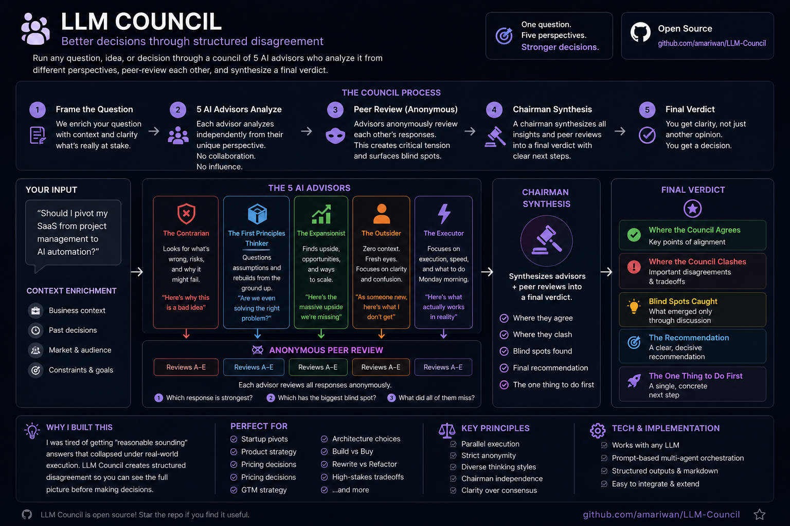

# LLM Council

<p align="center">
  
</p>

<p align="center">
  <strong>Better decisions through structured disagreement.</strong>
</p>

<p align="center">
  Run high-stakes decisions through 5 independent AI advisors, let them anonymously peer-review each other, and receive a synthesized verdict — not just a single AI opinion.
</p>

---

## Why I Built This

Most AI answers sound convincing.

That’s the problem.

The more I worked with LLMs, the more I noticed that AI is extremely good at producing answers that *feel right* while still being:
- shallow,
- biased,
- overly agreeable,
- or missing critical perspectives.

Most models optimize for:
- coherence,
- politeness,
- and “helpfulness”.

But real decision-making needs:
- disagreement,
- pressure-testing,
- conflicting perspectives,
- execution realism,
- and critical thinking.

So I built **LLM Council**.

Instead of generating one averaged answer, this system creates structured intellectual tension between multiple reasoning styles — then synthesizes the strongest insights into a final recommendation.

---

# How It Works

```text
Your Question
     │
     ▼
┌─────────────────────────────────────────┐
│         5 Independent Advisors          │
│                                         │
│  Contrarian · First Principles ·        │
│  Expansionist · Outsider · Executor     │
└─────────────────────────────────────────┘
     │
     ▼
┌─────────────────────────────────────────┐
│      Anonymous Peer Review              │
│                                         │
│  Advisors critique all responses        │
│  anonymously (A–E, no identities)       │
└─────────────────────────────────────────┘
     │
     ▼
┌─────────────────────────────────────────┐
│         Chairman Synthesis              │
│                                         │
│  Agreements · Conflicts · Blind Spots   │
│  → Final Recommendation                 │
└─────────────────────────────────────────┘
```

---

# The Five Advisors

| Advisor | Role |
|---|---|
| **The Contrarian** | Assumes the idea contains a fatal flaw. Searches aggressively for risks, weak assumptions, and failure modes. |
| **The First Principles Thinker** | Rebuilds the problem from fundamentals. Challenges assumptions and often reframes the question entirely. |
| **The Expansionist** | Focuses on leverage, upside, scale, and opportunities everyone else is ignoring. |
| **The Outsider** | Operates without insider context or bias. Excellent at detecting confusion and “curse of knowledge” problems. |
| **The Executor** | Focuses purely on practicality, speed, and execution. Asks: *“What actually happens Monday morning?”* |

---

# Built-In Tensions

The system intentionally creates productive conflict.

| Tension | Purpose |
|---|---|
| Contrarian vs Expansionist | Risk vs upside |
| First Principles vs Executor | Rethink vs execute |
| Outsider vs Everyone | Fresh perspective vs insider assumptions |

This tension is what makes the outputs stronger than a single-model response.

---

# When To Use It

## Great Use Cases

High-stakes decisions with real tradeoffs:

- Startup pivots
- Product strategy
- Architecture decisions
- Hiring decisions
- Pricing strategy
- Build vs buy
- Rewrite vs refactor
- GTM strategy
- AI system design
- High-risk execution decisions

### Example Questions

- *“Should I pivot my SaaS from X to Y?”*
- *“Which architecture is more future-proof?”*
- *“Should I hire first or automate first?”*
- *“Which positioning strategy is strongest?”*
- *“Am I solving the wrong problem entirely?”*

---

## Bad Use Cases

Do NOT use the council for:
- factual lookups,
- trivial technical questions,
- simple coding tasks,
- summarization,
- low-stakes decisions.

Examples:
- *“What’s the capital of France?”*
- *“Write a sorting function.”*
- *“Summarize this article.”*

The council is designed for judgment, not retrieval.

---

# Trigger Phrases

Use any of these:

| Trigger | Type |
|---|---|
| `council this` | Mandatory |
| `run the council` | Mandatory |
| `war room this` | Mandatory |
| `pressure-test this` | Mandatory |
| `stress-test this` | Mandatory |
| `debate this` | Mandatory |
| `should I X or Y` + real stakes | Strong |
| `I can't decide` + real stakes | Strong |
| `I'm torn between` + real stakes | Strong |
| `validate this` + real stakes | Strong |

---

# Example Output

```md
# Council Verdict: SaaS Pivot

## Where the Council Agrees
- The current positioning is too broad.
- The biggest bottleneck is distribution, not engineering.

## Where the Council Clashes
- Some advisors recommend doubling down.
- Others recommend narrowing aggressively.

## Blind Spots the Council Caught
- The user is optimizing for technical elegance instead of speed.

## The Recommendation
Do not pivot the entire product.
Narrow the ICP first and validate demand before rebuilding anything.

## The One Thing to Do First
Interview 10 paying users this week.
```

---

# Key Design Decisions

## Anonymous Peer Review

Advisor outputs are relabeled as A–E before review.

This prevents:
- authority bias,
- persona bias,
- and positional influence.

The advisors critique arguments — not identities.

---

## Chairman Independence

The Chairman can override the majority.

If one dissenting advisor presents a fundamentally stronger argument than the other four, the Chairman should side with the dissenter and explain why.

Consensus is not automatically correct.

---

## Parallel Execution

All advisors run simultaneously.

This prevents:
- sequential contamination,
- convergence bias,
- and early-response influence.

---

## No Hedging

Each advisor commits fully to its assigned thinking style.

The system works because perspectives collide instead of blending together into generic “balanced” output.

---

# Installation

This project is designed as a Claude skill.

## Setup

1. Clone this repository

```bash
git clone https://github.com/amariwan/LLM-Council.git
```

2. Install the skill into your Claude environment

3. Use a trigger phrase whenever you want to pressure-test an important decision

---

# Philosophy

The goal is not consensus.

The goal is clarity.

LLM Council replaces:
> “one plausible AI answer”

with:
> “a structured reasoning process with disagreement, critique, and synthesis.”

---

# Roadmap

Planned ideas:
- configurable advisor types,
- memory-aware councils,
- domain-specialized councils,
- visual council graphs,
- confidence scoring,
- multi-round debate systems,
- autonomous evidence gathering.

---

# Contributing

Contributions, experiments, and forks are welcome.

If you build custom advisor sets or improve the reasoning workflow, open a PR.

---

# License

MIT
